# Void Hole City

**You are a hole in a toy town.** Swallow anything smaller than you, grow until skyscrapers fit, and keep eating — or the ground seals over you.
The city fights back as you grow: police barricades, cement trucks, helicopters dropping concrete, and tanks.

**▶ Play in your browser:** https://aieatassam.github.io/void-game/

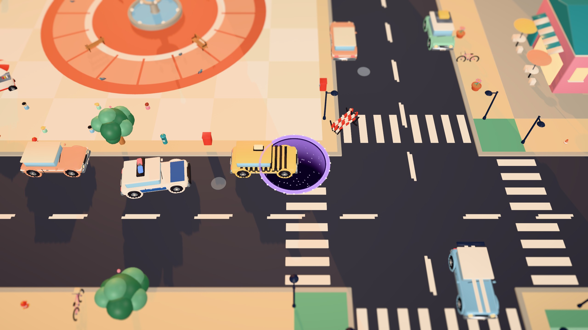

| | |
|---|---|
| 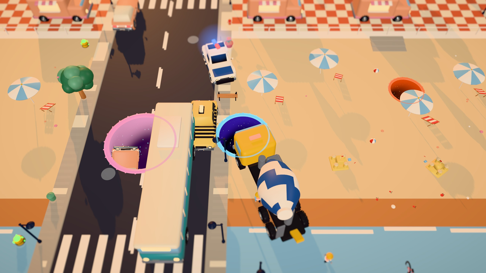 | 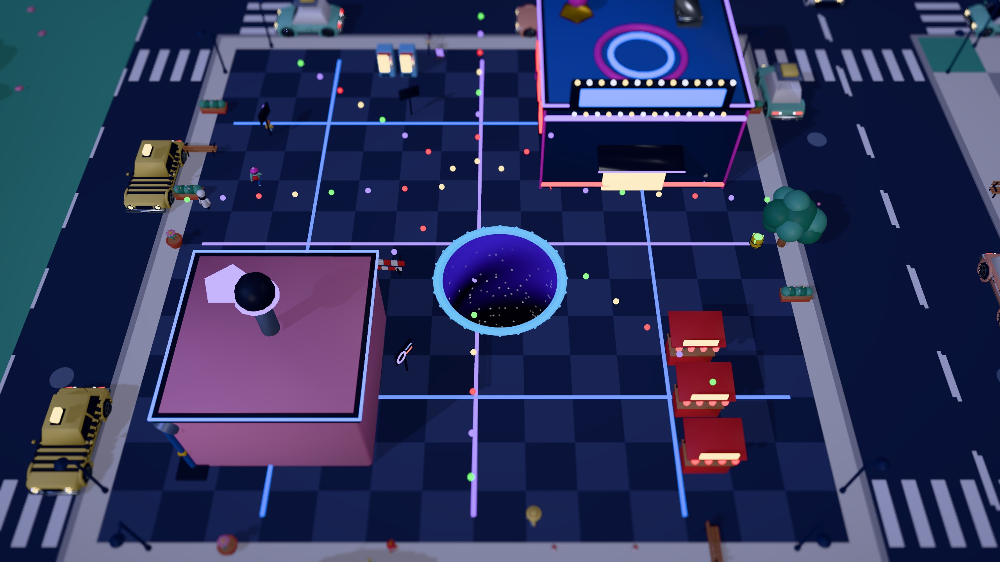 |
| 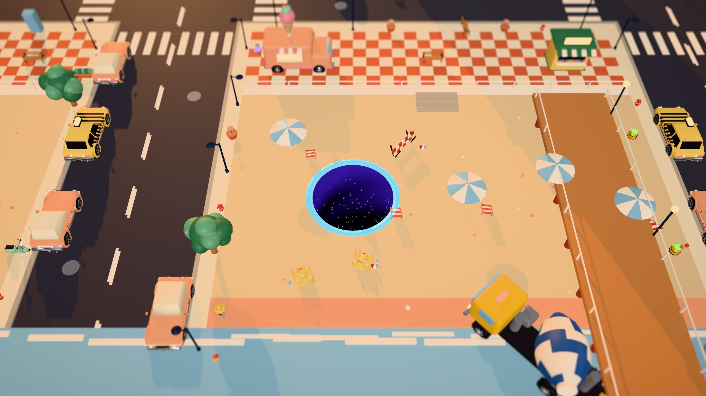 | 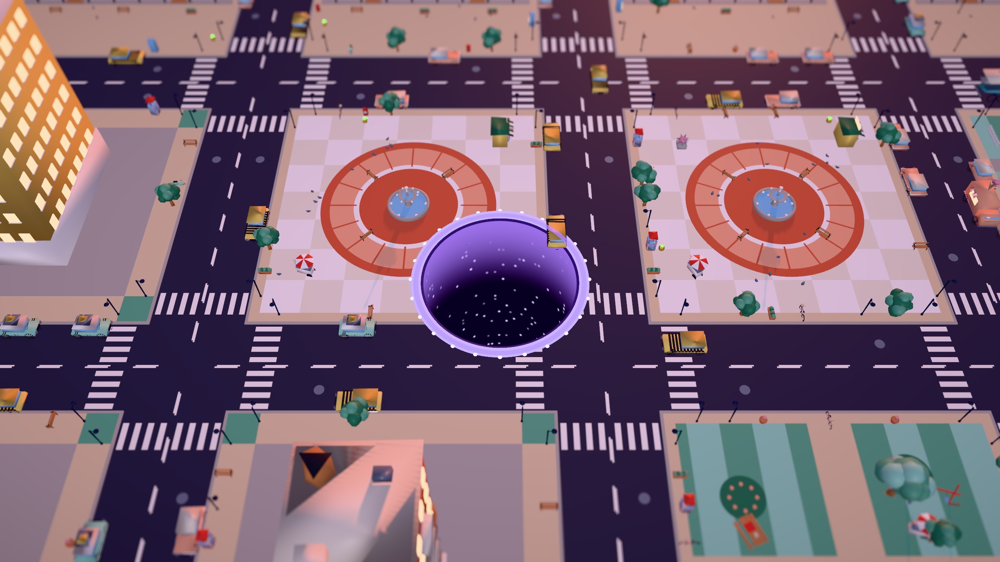 |
| 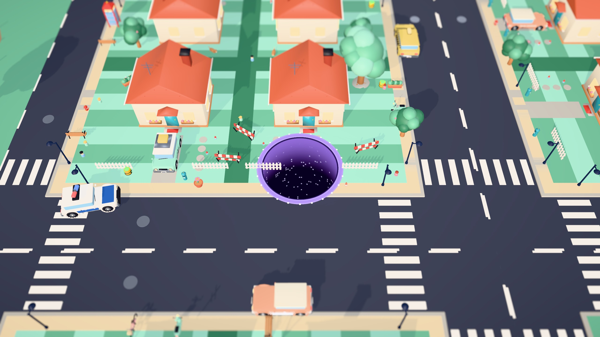 | 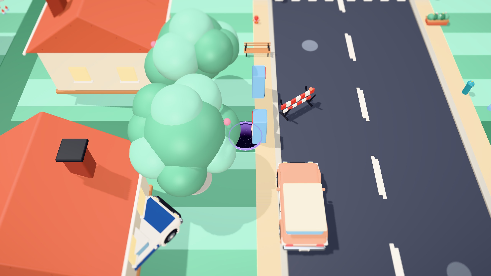 |
| 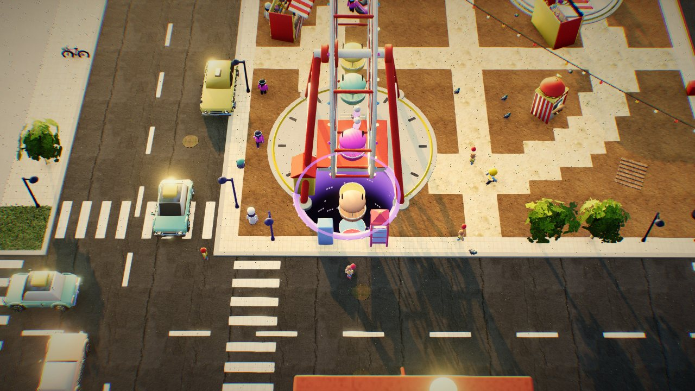 | 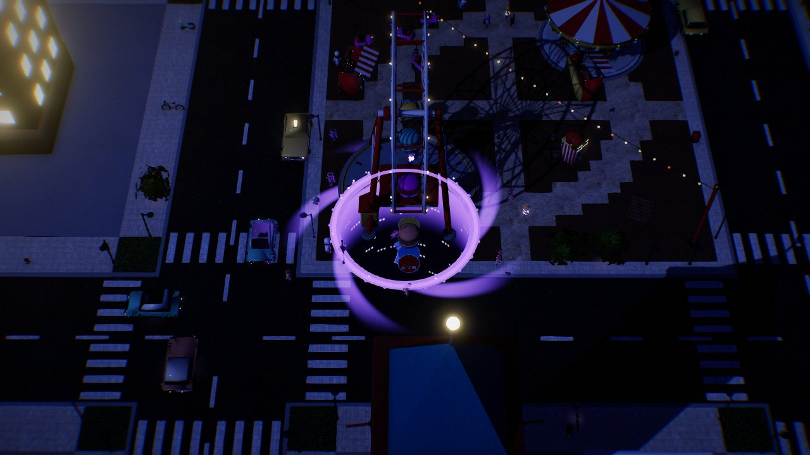 |
| 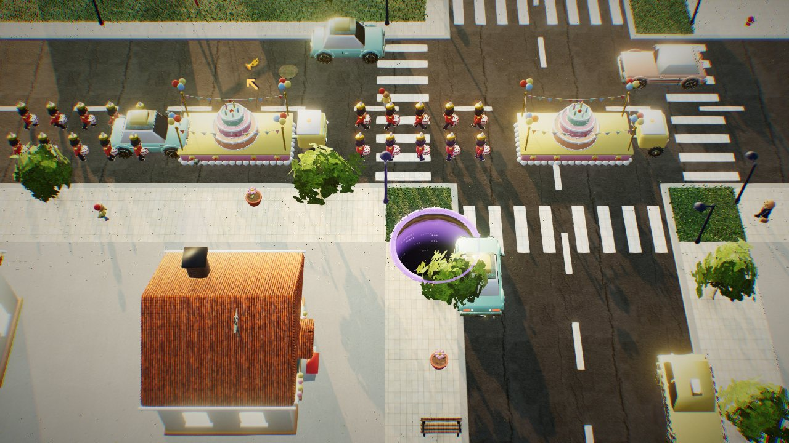 | 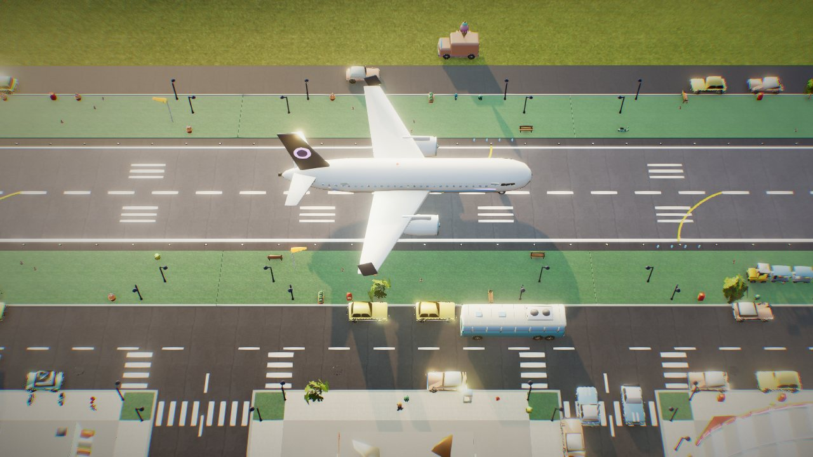 |
| 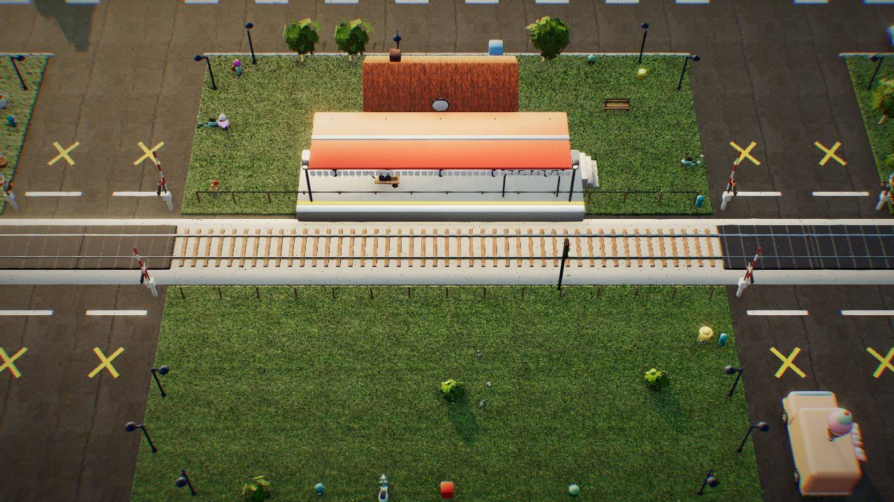 |  |
|  |  |

## The game
- **Grow:** everything has a size. Swallow what fits; each bite widens the hole by a share of the object's footprint —
  crumbs much smaller than you barely count, so you have to keep chasing real meals.
- **Starve:** a belly meter drains, and faster the longer the run goes on. Keep eating or you shrink — too small and the ground seals.
- **Cravings:** every so often the void wants something specific (3 cars, 4 people, 2 buildings…) against the clock. Satisfy it for a full belly, a combo kick and dust; miss it and you go hungry.
- **Heat ★1–4:** set by the higher of your size and your **notoriety** — eating police, units, buildings and cars makes the city hunt you;
  it cools only while you lay low. Police chase and ram, barricades toll you, cement trucks pour, helicopters drop concrete (red warning rings),
  tanks shell. Concrete stays **wet** for a while: sit in it and you slow down and shrink. From ★2 people **evacuate** into buildings, so food thins out.
- **Rival holes:** other holes eat the same city. Bigger swallows smaller — including you.
- **Poison:** gas cans shrink you, toxic barrels reverse your controls, spiky art jams the hole. Oversized cars can **clog** it.
- **Win:** swallow every building. Clear time is your score; the **Daily city** is the same map for everyone that day.
- **Breakout:** clear the town and the ground gives way. The hole escapes into the countryside, and now whole settlements
  are the meal: farmsteads, villages, a castle on its hill, a market town, an industrial valley and the capital. Buildings
  crumble into the hole, roads are the fast lanes, towns evacuate, and the army answers with roadblocks, artillery, strike
  jets and heavy-lift choppers dropping Void Lids, until the Capper rolls out of the capital. Swallow the capital to win.
- **Challenge cards:** pick one rule twist per run (Car Crusher, Rush Hour, Glass Cannon, Crowded…) for a dust multiplier.
- **Collection book:** every type of thing gets a page the first time you swallow it. Rare golden variants are hiding.
- **Progress:** void dust is scarce — a strong clear pays ~200 before its card multiplier, a defeat keeps half of its meal and combo dust.
  It buys small upgrades (a few percent per level, most with a catch) and hole skins (Galaxy, Lava, Cotton Candy, Black Hole). Unlocking
  everything takes dozens of runs.
- **Ten cities, unlocked in order:** Old Town → Suburbia → Waterfront → County Fair → Seaside → Fun Fair → Railway Town →
  Boomtown → Neon Nights → Airport City. Clear a city (or earn 2 of its stars) to open the next; the city picker shows each
  one's landmark, stars and lock. Every run rolls its own size, time of day and start spot.
- **Districts:** a fairground (ferris wheel, carousel, bumper cars, stalls, a crowd), a railway with a working train that stops at
  the station while traffic waits at the level crossings (eat it car by car — the rest uncouple), an airport whose airliner is the
  largest meal in the game, and a county fair of prize pumpkins, hay bales, scarecrows and tractors.
- **City events:** one surprise per run — a parade with floats, drummers and a giant balloon, a city marathon, a car show of
  spinning turntables with rare cars, or a UFO landing (eat it before it takes off).
- **Chain reactions:** swallow a gas station and the block blows apart, a fireworks stand lights up the sky, a water tower floods
  the street, falling buildings knock their neighbours over, and hydrants burst the water main.
- **Power-ups:** capsules drop around the city — Magnet, Ghost (the city loses you), Split (a twin hole) and Surge. Rivals want them too.
- **Abilities:** buy Quake, Vortex Burst or Dash with dust and fire them on a cooldown (Space / right-click / E, or the on-screen buttons).
- **Star challenges:** three goals per city, 30 in all. Stars open cities and unlock four more hole skins (5 / 10 / 20 / 30 stars);
  10 stars open a second ability slot.
- **Weekly:** one city per week with a twist — Low Gravity, Everything Is Ducks, Miniature, Night Shift or Rush Hour.

Controls: mouse, touch-drag or WASD · Space / right-click / `E` fire abilities · `M` mutes.

## How it's made
- **Engine:** [three.js](https://threejs.org) `WebGPURenderer` + Vite, every shader written in TSL (three's node shading language).
  Runs on WebGPU and falls back to WebGL2 automatically (force it with `?webgl`). Static build, no backend — runs on GitHub Pages.
- **Rendering:** physically based sky with sky-lit IBL, 4K soft sun shadows, aerial-perspective fog, GTAO ambient occlusion,
  HDR bloom, ACES filmic tonemapping with per-time-of-day exposure and a per-time-of-day 3D LUT grade, screen-space light shafts
  at golden hour and dusk, SMAA, vignette, lens fringe and film grain. Fair rides, festoons and runway lights run chase patterns
  that bloom; fireworks are GPU particles.
- **Materials:** 16 CC0 scanned PBR materials from [Poly Haven](https://polyhaven.com) (asphalt, paving, grass, brick, roof tiles, bark,
  rock…) packed into texture arrays. Every palette swatch maps to a scan, projected triplanar with tangent-free surface-gradient
  normal mapping, so toy models get real albedo, normal, roughness and AO detail; flat ground gets parallax occlusion on high.
  Polished metals are smooth with a brushed grain, windows have interior-mapped rooms, cars get clearcoat, fabric gets a sheen
  lobe, flutters in the wind and glows through in the sun; water has depth, waves and shore foam.
- **Nature:** a heightfield countryside (hills, lakes, a river, farm patchwork behind hedgerows, forests, moss-topped rocks),
  procedurally grown trees and bushes built from leaf-cluster cards cut from [ambientCG](https://ambientcg.com) leaf scans,
  and GPU grass — hundreds of thousands of procedural blades — all swaying in travelling gusts and thrashing when the hole passes.
- **Content packs:** the Stage 11 models (fair, airport, railway, county fair, events, chain props, power-ups, the duck) live in
  `public/models/packs.json` and download per city (`loadPack()`), behind the staged loading screen, so a run only fetches the
  districts it has.
- **Art:** ~130 models (detailed toy people with a GPU walk cycle, AAA-detailed toy cars), all procedural Blender Python scripts (`blender/assets/*.py`) driven through **Blender MCP**. One shared palette atlas + roughness/metalness atlas, so the whole city is one material; chrome, glass and gold are real metals/gloss.
- **Performance:** every model ships 3 LODs (full, ~25%, ~8% via meshoptimizer). The city is instanced per asset per 40 m chunk and culled; far chunks drop to LOD2 and stop casting shadows.
- **Quality tiers:** tablets and phones start on `low` (1x resolution, single-projection texture sampling, lighter AO, sparse grass, no full-detail models
  downloaded) and keep the full look; desktops start on `high`. A watchdog sheds the least visible cost first if the frame rate drops
  (resolution, AO resolution, grass, then AO and bloom). Force a tier with `?q=low|medium|high`; `?fps` shows a live performance overlay.
- **Design rules:** no dead ends — nothing blocks movement, a size-ladder check (`npm run check`) guarantees there's always something slightly smaller to eat, and every hit is capped.

## Develop
```bash
npm install
npm run dev          # game at http://localhost:5174, model showroom at /gallery.html
npm run check        # size ladder: no gaps > 1.3x between edible sizes
npm run build        # static site in dist/
python3 tools/textures.py   # rebuild the PBR texture library in public/tex (Pillow + numpy; downloads CC0 scans)
```
Debug URL flags: `?webgl` (WebGL2 backend), `?seed=7`, `?time=golden|noon|morning|dusk|night`, `?mood=seaside`, `?r=6` (start radius),
`?view=x,z,dist[,yaw,pitch]` (fixed camera), `?start=beach` (start tile), `?tide` (hold the flood), `?grass=0.5` (blade density),
`?q=low|medium|high`, `?fps`, `?nopost`, `?noao`, `?low`, `?event=parade|marathon|carshow|ufo&eventAt=5` (force the run's event),
`?mutator=lowgrav|ducks|mini|night|rush`, `?abil=quake,dash,vortex` (equip abilities), `?allcities`, `?tone=agx`,
`?noshafts`, `?nolut`, `?off=glass,cav,jit,brush,sheen` (disable new material terms), `?region` (start in Phase 2; with `?r=`
for the size), `?nophase2` (win at the town clear), `?noarmy`. In the dev server, `__snap('name')` saves the graded frame to
`.shots/name.jpg` even when the window is in the background. `test.html?mat=trees|grass|toy|ground`
renders materials in isolation; `node tools/shot.mjs out.png "?seed=7&webgl"` captures a frame headlessly.
Rebuild art (Blender with the MCP add-on running): run `blender/build_all.py` inside Blender, then `npm run optimize`.

Playtest bot: open `/?bot` and run `__runBot(600)` in the console (`__sloppy = true` for a careless player), or headless:
`node tools/botrun.mjs "&seed=7" 900 [1]` prints the run log and the itemised dust payout.
`node tools/balance.mjs "&mood=fun" 420 777,42 greedy,sloppy` sweeps seeds (greedy + careless bot), `tools/perf.mjs` reports draw
calls and triangles, `tools/probe.mjs` evaluates an expression in a headless run, `tools/sheet.mjs` renders showroom contact sheets.
Latest balance check (docs/BALANCE.md): the greedy bot clears 7 of 12 seeds in 2:57–4:31 and sometimes dies; with abilities 8 of 12;
the careless bot mostly doesn't clear.

See [PLAN.md](PLAN.md) for the build stages and [ART.md](ART.md) for the art bible.
