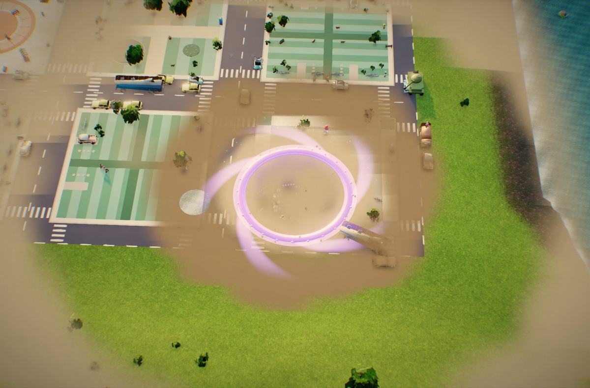
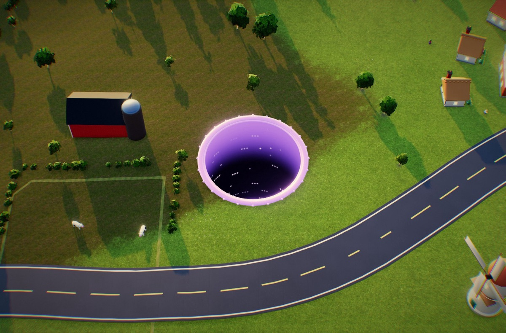
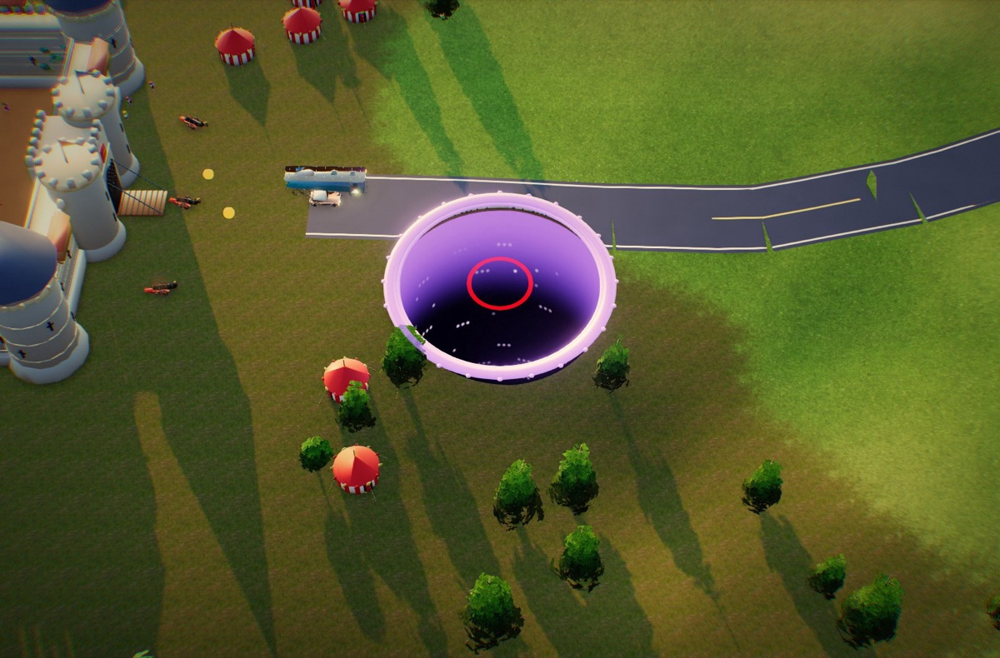
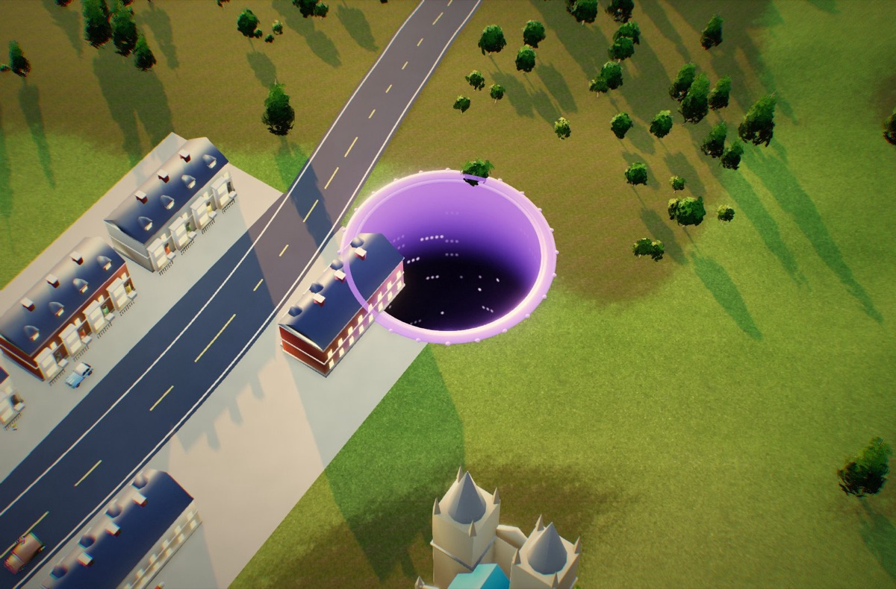
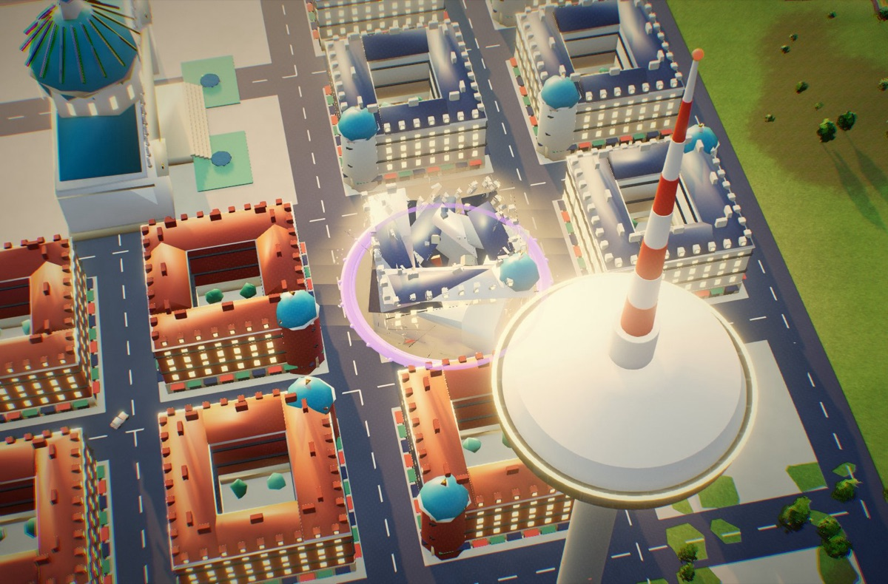
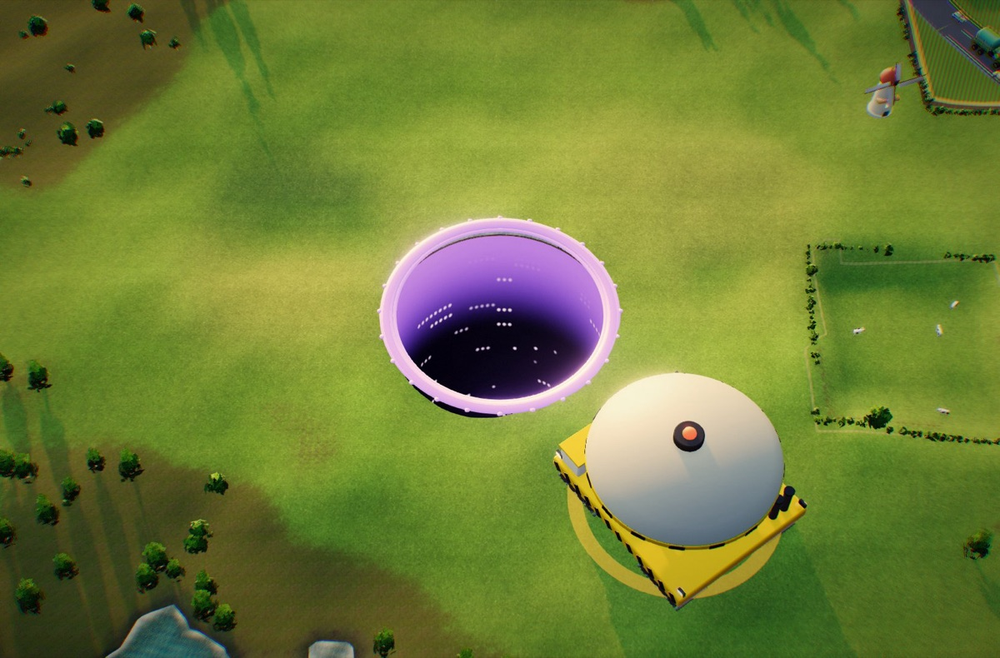
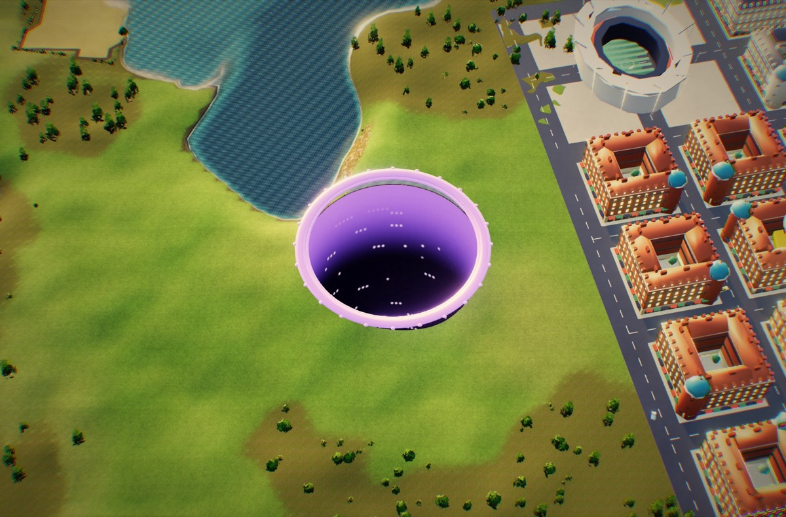
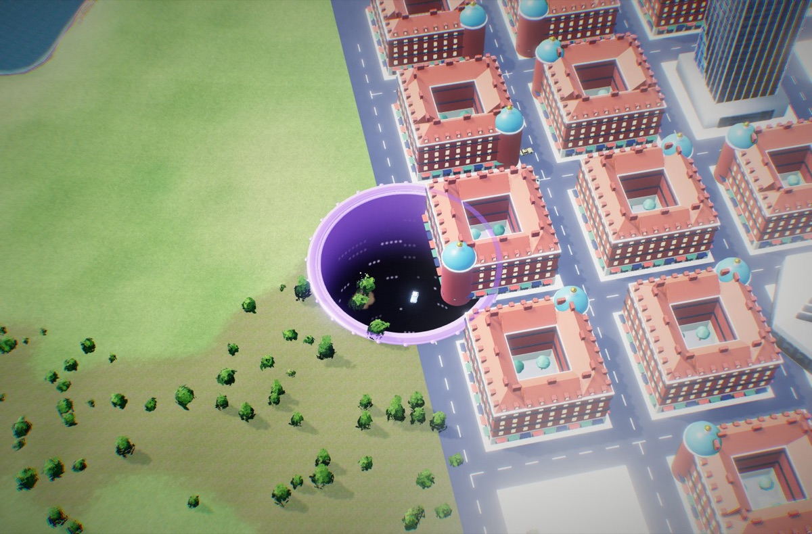

# Phase 2 — Breakout: the hole goes regional

Phase 1 ends when the last building in town falls. Today that's the win screen. In Phase 2 it's the moment the void
**breaks out**: the ground around the emptied town gives way, the hole surges, the camera climbs, and the countryside
becomes the map. Villages, a castle, market towns, an industrial valley and finally the **capital** stand between the
hole and the horizon, joined by roads. The hole grows from ~10 m to ~60 m. The army, not the police, answers.

This document is the design: transition, loop, size ladder, settlements, adversaries, human response, the crumble,
terrain, scale, performance, then the build order. Numbers are starting values for the bot balance pass.

## Status (branch `feature/phase-two`)

Built and playable end to end. Try it with `?region` (straight into Phase 2 at 10 m) or clear any town normally.

| Screens | |
|---|---|
|  |  |
|  |  |
|  |  |
|  |  |

| Area | What's in | Where |
|---|---|---|
| Models | 36 new models, sized to the ladder (§4); `npm run check` passes with the region pack | `blender/assets/*.py` (REGION in build_all.py), pack `region` |
| Breakout | bank the town, slow-mo lift with a lower kaiju angle, four dust fronts rolling out to the city limits, surge; the region is prebuilt in 3 ms slices while the town is being eaten, so the swap under the dust takes ~1.7 s with no long tasks | `main.js` `breakout()`, `prebuildRegion()` |
| Region | 10 settlements (4 farmsteads, 2 villages, castle, market town, industrial valley, capital) on levelled pads, a road tree with traffic, a wind farm, a pylon line; terrain to ±1.5 km with mountains beyond; 34k trees, hedges, rocks and cows as edible crumbs | `region.js`, `terrain.js` region mode |
| Crumble | parts break away in a staggered pancake toward the hole (per-vertex part centres, per-instance progress, no new pipelines); dust fronts sized to the building; applies to the town's buildings too | `surface.js` `crumbleMaterial`, `city.js` `startCrumble` |
| Army | threat 1-4: roadblocks, artillery, the castle's cannons, strike jets, heavy-lift Void Lids, and the Capper at the capital | `army.js` |
| Human response | evacuation (cars queue out, crowds run), church bells and air-raid sirens, news ticker with a population counter | `region.js` `evacuate`, `phase2.js` `News`, `sfx.js` |
| Surfaces | roads x1.35, farmland x1.1, woods x0.88, marsh x0.7, water x0.55 (shown in the status line) | `region.js` `surfaceSpeed` |
| Scale cues | camera pull-back and far/near planes that follow it, cloud shadows over the whole region, low cloud wisps at the edges of the view once the hole is big, people and cars stay visible as specks, slower collapses for bigger buildings | `fx.js` `Wisps`, `city.js` |

**Measured** (Apple Silicon, WebGPU, high tier): about 100 draw calls and 0.4-1.2M triangles a frame at a village, a town
and the capital (r = 12-40); CPU ~7-8 ms a frame including render submission. Greedy bot, seed 4242: 10 m -> 49 m, the
capital swallowed at 4:36, 29 army hits taken; eating everything in size order can take a 12.5 m hole past 60 m.

**Changed from the plan above:** the stadium is tier 39 (not 44) to keep the ladder at 1.3x, so the capital needs a ~41 m
hole and the run peaks around 50-65 m. The region is 3 km across (not 3.6). Rivals, the settlement perk draft, the minimap,
birds, the rim crack ring, dams and bridges are not built yet; the town's powerups and events are quiet in Phase 2.

---

## 1. What the research says about scale (and what we take from it)

| Finding | Source | What we do |
|---|---|---|
| Scale is read from **familiar reference objects**; growth feels real when you can compare against things you know (cars, houses, people). | Katamari analysis, environment-art scale guides | Phase 1 props never disappear. Cars stream along roads, trees fill forests, cows in fields, people pour out of houses. At a 60 m hole they are specks, and that *is* the point. |
| **Revisiting** a place you once struggled in, now as a giant, is the strongest growth moment. | Katamari (Gregory Weir) | The emptied hometown stays in the middle of the map as a scar. Breakout starts there. The first settlements are made of models you ate one by one in Phase 1 (houses, barns, windmills), now eaten in whole streets. |
| **Weight**: big things move slower and deliberately; a giant is not a scaled-up small thing. | Kaiju design / creature-scale guides | Steering inertia grows with size; debris falls at real gravity (not the snappy 3 g of the toys); collapses take seconds; rumble sounds drop in pitch; camera shake lags and rolls instead of jitters. |
| **Delayed reactions**, dust clouds and ground response sell size better than the object itself. | Kaiju VFX notes | Buildings crack *before* they fall, dust fronts roll out across streets, the ground at the rim breaks into slabs, birds lift off ahead of the hole. |
| **Atmospheric perspective**: far things are lighter, bluer, less detailed. Cloud shadows (gobos) break up big landscapes and read as scale. | Environment-art guides | Fog range and colour follow the camera altitude. Drifting cloud shadows over the terrain from Phase 2 on; at large sizes low clouds slide *between* the camera and the ground. |
| **Camera pull-back** at size milestones, plus fog at the extremes. | Katamari | Existing pull-back continues; breakout, settlement clears and the boss get short low-angle "hero shots" (the kaiju low angle) before snapping back to the play camera. |
| Tilt-shift / shallow depth of field makes things read **miniature**. | Miniature faking | We avoid it in Phase 2. (It was already removed after the iPad test.) The toy look stays in the models and grade, the lens stays honest. |

Sources are listed at the end.

**Keeping it exciting (not just bigger):** Katamari's growth is continuous inside a level, with a clear target ahead.
Hole.io/Donut County stay short and end on a set piece. So: every settlement is a short set piece with its own twist
(castle cannons, a factory chain reaction, a dam), the next target is always visible on the horizon with a marker,
threats escalate in *kind* not only in count, and the run ends on a boss at the capital.

---

## 2. The transition ("Breakout", ~4 s)

Triggered when `state.left === 0` in a normal city run (not Blitz, not `?nophase2`, not bot balance runs unless `?region`).

1. **Hit-stop + silence** (0.3 s): the last building's bite freezes, audio ducks.
2. **The ground gives way:** a crack ring races out from the hole to the city limits (ground-shader crack pattern),
   every town tile sags a few decimetres toward the hole, debris and a huge dust ring roll outward.
3. **Surge:** the hole grows ×1.25 over 2 s with a shockwave (existing `hole.shockwave()`, scaled).
4. **Camera lift:** the existing `finale` lift, extended: it rises to the Phase 2 framing with a slow yaw, and a
   low-angle beat on the rim. Time runs at 0.3× throughout, so the heavy work (building the region, compiling its shaders)
   happens behind the cinematic without visible hitches.
5. **News beat:** a `BREAKING` lower-third: *"Void hole escapes Old Town — army mobilised"*. Population counter appears.
6. **Control returns** with a pulse on the marker pointing at the nearest settlement.

Phase 1 results are banked at breakout: clear time, fastest, daily best, stars, contracts, dust (a "City cleared" toast
instead of the results screen). Phase 2 only ever *adds* to the run's payout, so no Phase 1 score changes.

**World swap:** the region is a new `Region` built with the same seed: the old town's ground tiles (now empty) stay as
the centre, the same terrain noise continues outward, so the swap under the dust ring is invisible. Leftover small props
are simply eaten by the surge.

---

## 3. The Phase 2 loop

- **Goal:** swallow the **capital**. Everything else is fuel and route choice. The capital's biggest pieces need a
  ~55–60 m hole, so you must feed through the settlements on the way; the ladder makes "too big" a hint, never a wall.
- **Map:** a ~3.6 km square of countryside (§6). 7–9 settlements on a rough spiral outward from the hometown: small
  ones close, the capital far out against the mountains. Roads connect them all.
- **Navigation:** an edge marker (existing `edgeArrow`) points to the nearest settlement you can currently eat; a
  minimap shows settlements, roads and threats. Settlement names show on approach ("Ashby — pop. 420").
- **Clearing a settlement** (all its buildings): a *"Ashby is gone"* banner, a hero-shot, a perk draft (existing
  drafts, re-used) and a payout. Settlements left standing don't block anything.
- **Hunger** rescales (the Phase 1 meal cap `min(area, π·36)` makes the belly trivial past 6 m): Phase 2 has its own
  belly with a meal = 8% of current area, drain 1/10 s, decay fed 0.6%/s, starving 4%/s. Between settlements the
  countryside (forests, farms, convoys) keeps you alive but not growing much: you *need* the towns.
- **Speed/weight:** top speed `6.5 + r·1.8` becomes `min(40, 18 + r·0.5)` in Phase 2 (sub-linear: big feels heavy, the
  map is still crossable in ~1 min), steering smoothing `kv` goes from ~0.1 s to ~0.45 s at 60 m.
- **Losing:** shrinking below 6 m seals the ground (as Phase 1). Rule 3 still holds: no hit > 25%.
- **Length:** ~6–8 min for Phase 2 on top of the 3–5 min city.
- **Growth arithmetic:** a half-size bite adds ~4% area; 10 → 60 m is ×36 area ≈ 90 such bites. Each settlement
  therefore carries plenty of mass in the 0.3r–0.5r band for the hole size it's meant for (checked by the bot).

---

## 4. Size ladder and model list

Rule (PLAN.md): consecutive sizes ≤ 1.3× apart, from the manifest. Steps from 10 m: 13, 17, 22, 29, 37, 48, 63.
Tier = footprint radius in metres (existing convention). Existing models already cover the start (house 4, barn 7.9,
windmill 8, skyscraper 9.45, airliner 14).

| Band (hole r) | New models (tier ≈) | Settlement |
|---|---|---|
| 3–6 (crumbs at 10 m) | cottage 3.2, thatched cottage 3.4, grain silo 3.0, pylon 3, howitzer 2.8, army truck 2.2, chimney stack 3.5 | hamlet, village, fields |
| 6–10 | farmhouse 5, village inn 5, village church 7, castle tower 5.5, fuel tank 7, wind turbine 5 | village, castle, industry |
| 10–13 | castle wall 9, castle gatehouse 10, townhouse row 9, market hall 10.5 | castle, market town |
| 13–17 | town hall 13, factory 15, gasholder 13, heavy-lift heli 12 | market town, industry |
| 17–22 | castle keep 17, cathedral 20, city block 18, glass tower 16 | castle, town, capital |
| 22–29 | cooling tower 24, supertall 27, TV tower 22 | industry, capital |
| 29–37 | parliament 33, capper boss 30 | capital |
| 37–48 | stadium 44 | capital |

Roads, fields, forests and rock are generated in code, not modelled.

---

## 5. Settlements

Each is a *layout recipe* placed on a flattened pad of terrain, oriented along its road, with its own street pattern.
Styles come from the palette (cream/terracotta Mediterranean, brick Victorian, grey stone medieval, glass modern).

| Settlement | Distance | Needs r | Contents | Twist |
|---|---|---|---|---|
| **Farmsteads** (3–5) | 150–500 m | 6–10 | farmhouse, barns, silos, hay bales, cows, tractors | Crumbs on the way. |
| **Village** (2) | 250–600 m | 9–12 | cottages round a green, church, inn, windmill, walls, orchards | Church bells ring: villagers stream out. |
| **Castle** | 500–900 m, on a hill | 12–18 | curtain walls, towers, gatehouse, keep, chapel, a festival camp outside | **Heritage festival:** cannons fire cannonballs (ring warnings). The walls are swallowed segment by segment. |
| **Market town** | 600–1000 m | 12–22 | terraced streets, market hall, town hall, cathedral, canal | Army cordon: sandbag toll lines on its roads. |
| **Industrial valley** | 800–1300 m, by the river | 14–26 | factories, chimneys, gasholders, fuel tanks, cooling towers, power station, pylons | **Chain reactions:** fuel tanks and gasholders go up (existing chains, bigger). Pylons zap. |
| **Capital** | 1300–1700 m, across the river | 18–60 | city blocks, glass towers, supertalls, TV tower, stadium, parliament, bridges, highway ring | The boss (§7) and the full military response. |

A settlement is **cleared** when its buildings are gone (phase 1 `BUILDINGS` rule, per settlement).

---

## 6. Terrain, surfaces, roads and hazards

**Terrain:** the existing `Terrain` noise, extended to ±1.8 km. The play area is a fine grid (Q.terrainStep, ~6–8 m);
mountains ring the edge and are the map boundary. Settlement pads and road corridors are flattened in `heightAt`.
Hills inside the play area are kept gentle (≤ 1:6) so the rim sits on the ground. Sectors grow to 192 m (fewer draws
when zoomed out). **The terrain shader gets the hole cut** (same `holeField` test as the ground), and the city's
`groundY/groundSpan` sample the terrain outside town.

| Surface | Where | Effect on the hole |
|---|---|---|
| **Road / highway** | between settlements | **+35% speed.** Roads are the fast lanes; the evacuation traffic is on them. |
| **Soft farmland** | fields | +10% speed, crumbs (hay, crops). |
| **Forest** | noise patches | trees are edible crumbs (the hole mows lanes through woods); -10% speed. |
| **Marsh / river banks** | near water | slow (×0.6, the existing flooded path). |
| **Water** (lakes, river) | basins | the hole *drains* it: slow ×0.5 and hungrier, whirlpool FX; boats are snacks. Bridges cross the river. |
| **Bedrock** (rock outcrops, mountain foot) | ridges | the hole can't open in rock: grinding toll (small size loss/s) and slow. Never a wall (rule 1). |
| **Power lines** | pylon rows across the map | swallowing a pylon **zaps**: 1 s jam + sparks (poison class). |
| **Fuel depots** | industry | chain explosions (existing chains). |

**Roads** are ribbons generated along splines between settlements (and a ring road around the capital): tarmac with
edge lines, dropped onto the flattened corridor, drawn with the ground material, so they cost a few draw calls.
Vehicles drive them with a new `road` mover (existing traffic models: cars, buses, vans, army trucks).

---

## 7. Adversaries (sized for a 10–60 m hole)

The Phase 1 police/cement/heli/tank escalation is too small to matter now. Phase 2 has a **threat level 1–5**,
driven by size and notoriety (same hysteresis as Heat). Every attack is telegraphed on the ground; nothing blocks
movement; every hit is ≤25% and temporary; every ground unit is edible.

| Threat | Unit | Attack | Counter / fate |
|---|---|---|---|
| 1 | **Army trucks + roadblocks** | sandbag toll lines across roads near towns (existing barricade logic, bigger) | Go round or pay the toll; trucks are snacks. |
| 2 | **Artillery batteries** (howitzers on hills) | shells arc in, red ring warnings a beat ahead, a salvo of 3–6 | Keep moving; eat the battery (it's small). |
| 3 | **Jet strike** | a strafe *line* telegraphed across the map, jets scream over ~2 s later, bomblets along the line | Get off the line. Jets can't be eaten (they fly off: temporary). |
| 4 | **Heavy-lift helicopters** | carry giant **void lids** (the Phase 1 concrete plug, scaled) and drop them ahead of the hole | A lid on you = clog + hit; lids crumble after 20 s or can be eaten once you're big enough. |
| 5 | **The Capper** (boss, capital) | a colossal tracked crawler carrying a dome lid; it trundles after you and tries to cap the hole: a slow ring that closes if you stay inside it for 2 s (big hit + ejects you, not death) | It's edible once you're past its tier (30 m): the final set piece is outgrowing it in the capital, then swallowing it. |

**Rivals** carry over: rival holes that survived Phase 1 break out too and roam the region (still at most 3).

## 8. Human response (at this scale)

Readable at a 700 m camera: people are 5 px, cars 13 px, so humans read as **streams and swarms**, not individuals.

- **Evacuation convoys:** when the hole comes within ~300 m of a settlement, traffic pours out along its roads, away
  from the hole. The convoys are edible streams: follow the road and feast, or ignore them and hit the town.
- **Crowds** leave houses as dense swarms (instanced peds, cheap waddle shader), heading for the roads.
- **Bells and sirens:** church bells in villages, air-raid sirens in towns, rising with the threat level.
- **News ticker:** a lower-third that reports what you've done ("Ashby swallowed — 420 evacuated"), with a live
  *population swallowed* counter. This carries the scale in numbers.
- **Birds** lift off in flocks ahead of the hole (particles), and boats flee across lakes.
- **Night:** searchlights sweep from the capital; windows go dark as towns lose power when you eat a pylon line.

---

## 9. The crumble (not "drop down")

Big buildings (tier ≥ 4) fall in four beats instead of tipping and sinking:

1. **Warning (0.3–0.8 s, scales with tier):** the building shudders, dust pours from its base, lilac void cracks glow
   along fracture lines, windows flicker out.
2. **Break-up:** the building is moved into a small **crumble pool** (one `InstancedMesh` per big model, a handful of
   instances). Its material shatters the mesh into object-space voronoi cells in the vertex shader. Each cell drops with a
   delay by height and by side (the side over the hole goes first, then it pancakes), and tilts toward the hole.
   Cells stay inside the disc (the Phase 1 rule: nothing pokes through the ground outside the hole).
3. **Dust front:** a ring of big, slow puffs rolls outward across the streets, sized to the building, lit by the sun,
   lingering 3–5 s. Chunks (existing instanced debris) spray from the break line. Real gravity (9.8) for big debris,
   so falls look heavy and slow.
4. **Ground:** the pavement around the rim breaks into slabs that tilt into the hole (ground-shader crack ring around
   big holes, animated by recent bites).

Why a pool: adding a per-instance crumble attribute to every building chunk would create new material variants on
every chunk (each a first-sight shader build, see PERFORMANCE.md). The pool's ~20 shaders are compiled during breakout.

---

## 10. Performance plan

| Risk | Plan |
|---|---|
| Shader builds on first sight (open issue, per `InstancedMesh`) | Region chunks are **per settlement** (one mesh per model per settlement), not per 40 m; region shaders compile during breakout's slowed time. |
| LOD / shadow distances are fixed metres (`LOD_DIST = [15, 60]`, 35 m casting) | Scale both by `max(1, r / 4)`; things under 3% of the hole stop drawing (existing rule); scenery casts only above 10% of the hole. |
| Far plane 1600 m | Far plane follows `camDist × 3`. |
| Thousands of trees now edible | Tiny things (tier < 0.06 r) are eaten as a batch: removed without the fall animation, with a crumb burst. Forest instances cull per chunk as now. |
| Terrain size | 3.6 km at ~7 m in the play area ≈ 260k vertices, sectors 192 m (≈ 30 visible). Mountains beyond at the coarse falloff. |
| Crowds | one instanced swarm per settlement, spawned only on evacuation; pooled. |
| Dust fronts | existing puff points, ring-buffered; count scales down on low tier. |
| Entity update loop | settlements beyond 2 camera widths sleep (movers frozen, no swallow tests). |

Measured with the existing tools (`?fps`, `tools/perf.mjs`) and the real-device pass method in PERFORMANCE.md.

---

## 11. Test flags

- `?region`: start straight in Phase 2 (hole at 10 m) for fast iteration and bot runs.
- `?nophase2`: old behaviour (win at city clear), for bot balance and screenshots.
- `?r=` still works; `?threat=N` forces a threat level.

## 12. Build order (each ends with a commit)

1. **This design.**
2. **Models** (§4): Blender scripts in `blender/assets/`, `REGION` list in `build_all.py`, exported as a pack; reviewed in
   the gallery beside a house for scale; ladder check.
3. **Region world:** terrain extension + hole cut, settlements, roads, `?region`.
4. **Transition:** breakout cinematic, world swap, banking Phase 1, HUD (marker, ticker, population).
5. **Crumble** pool + dust fronts + rim cracks.
6. **Adversaries + human response.**
7. **Hazards and surfaces.**
8. **Perf pass + bot balance** (greedy clears Phase 2 in 6–8 min; sloppy dies sometimes).

## Sources

- [Analysis: How Katamari's scale makes you high (Game Developer)](https://www.gamedeveloper.com/design/analysis-how-i-katamari-i-s-scale-makes-you-high)
- [Postmortem: the singular design of Katamari Damacy](https://www.gamedeveloper.com/design/postmortem-the-singular-design-of-namco-s-katamari-damacy-2004-)
- [Kaiju VFX techniques used in Godzilla movies (TurboSquid)](https://blog.turbosquid.com/2024/08/29/kaiju-vfx-techniques-used-in-godzilla-movies/)
- [How big should your creature be? Size and scale guide](https://creature-street.com/how-big-should-your-creature-be-a-complete-size-scale-guide/)
- [The art of environmental effects (RMCAD)](https://www.rmcad.edu/blog/the-art-of-environmental-effects-bringing-game-worlds-to-life/)
- [Creating vast landscapes in 3D](https://3dartist.substack.com/p/creating-vast-landscapes-in-3d)
- [Miniature faking (Wikipedia)](https://en.wikipedia.org/wiki/Miniature_faking)
- [Chaos Destruction in UE5 without tanking frame rate](https://www.strayspark.studio/blog/chaos-destruction-ue5-destructible-environments)
- [How destructible meshes break apart in games](https://salivity.github.io/game-development/article/how-destructible-meshes-break-apart-in-games)
- [Donut County](https://en.wikipedia.org/wiki/Donut_County), [Hole.io](https://en.wikipedia.org/wiki/Hole.io)
